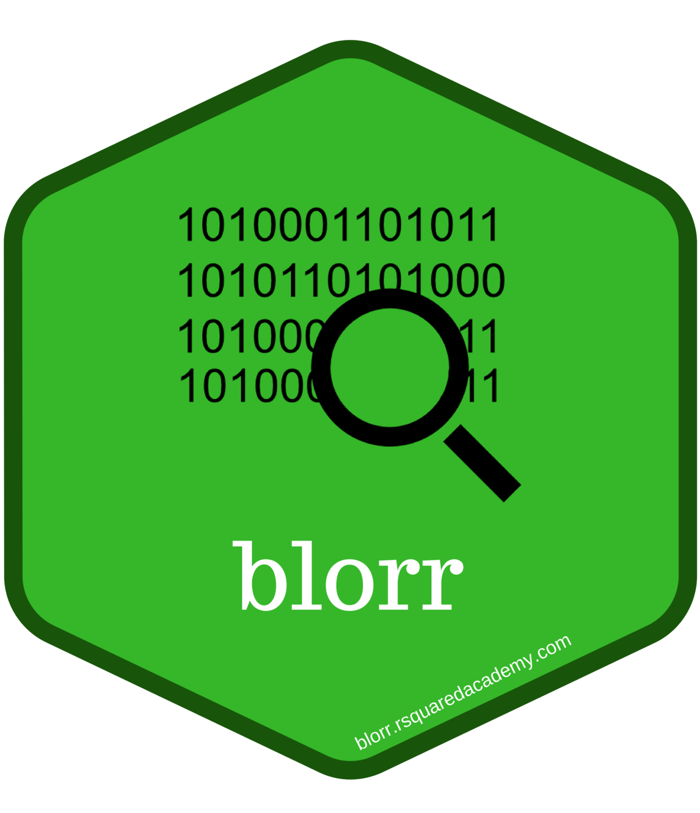

<!-- README.md is generated from README.Rmd. Please edit that file -->

```{r, echo = FALSE}
knitr::opts_chunk$set(
  collapse = TRUE,
  comment = "#>",
  fig.path = "tools/README-"
)
options(tibble.width = Inf)
```

blorr: Tools for building binary logistic regression models 
------------

**Author:** [Aravind Hebbali]()<br/>
**License:** [MIT](https://opensource.org/licenses/MIT)

[](https://cran.r-project.org/package=blorr) [](https://cran.r-project.org/web/checks/check_results_blorr.html)
[](https://travis-ci.org/rsquaredacademy/blorr) [](https://ci.appveyor.com/project/rsquaredacademy/blorr) 
[](https://cran.r-project.org/package=blorr) [](https://codecov.io/github/rsquaredacademy/blorr?branch=master) 
 
Tools designed to make it easier for users, particularly beginner/intermediate R users to build logistic regression models. Includes comprehensive regression 
output, variable selection procedures, model validation techniques and a 'shiny' app for interactive model building.

### Installation

```{r gh-installation, eval = FALSE}
# Install blorr from CRAN
install.packages("blorr")

# Or the development version from GitHub
# install.packages("devtools")
devtools::install_github("rsquaredacademy/blorr")
```

### Shiny App

Use `blr_launch_app()` to explore the package using a shiny app.

## Vignettes

- [A Short Introduction to the blorr Package](https://blorr.rsquaredacademy.com/articles/introduction.html)

### Consistent Prefix

blorr uses consistent prefix `blr_*` for easy tab completion.

### Quick Overview

```{r libs}
library(blorr)
library(magrittr)
```

#### Bivariate Analysis 

```{r bivar}
blr_bivariate_analysis(hsb2, honcomp, female, prog, race, schtyp)
```

#### Weight of Evidence & Information Value

```{r woeiv}
blr_woe_iv(hsb2, prog, honcomp)
```

#### Model

```{r model}
# create model using glm
model <- glm(honcomp ~ female + read + science, data = hsb2,
             family = binomial(link = 'logit'))
```

#### Regression Output

```{r regress}
blr_regress(model)
```

#### Model Fit Statistics

```{r mfs}
blr_model_fit_stats(model)
```

#### Confusion Matrix

```{r conf}
blr_confusion_matrix(model)
```

#### Hosmer Lemeshow Test

```{r hoslem}
blr_test_hosmer_lemeshow(model)
```

#### Gains Table

```{r gains}
blr_gains_table(model)
```

#### Lift Chart

```{r lift}
model %>%
  blr_gains_table() %>%
  plot()
```

#### ROC Curve

```{r roc}
model %>%
  blr_gains_table() %>%
  blr_roc_curve()
```

#### KS Chart

```{r kschart}
model %>%
  blr_gains_table() %>%
  blr_ks_chart()
```

#### Lorenz Curve

```{r}
blr_lorenz_curve(model)
```

Please note that this project is released with a [Contributor Code of Conduct](CONDUCT.md). By participating in this project you agree to abide by its terms.
