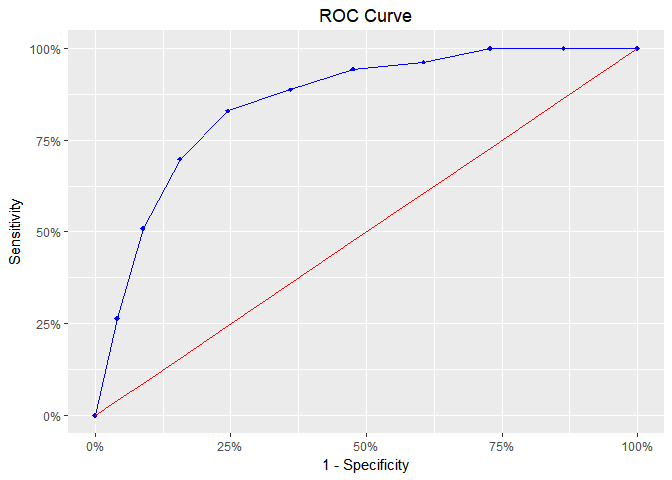
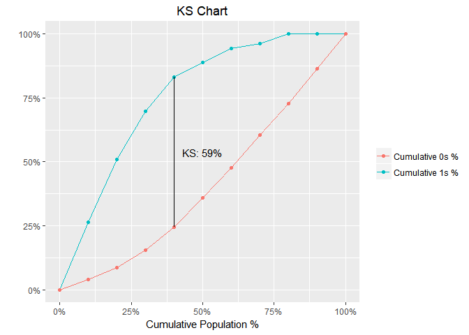
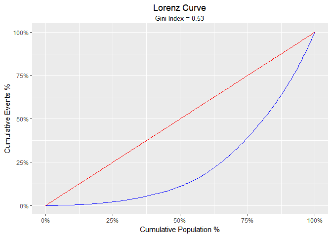

<!-- README.md is generated from README.Rmd. Please edit that file -->

## blorr: Tools for building binary logistic regression models

**Author:** [Aravind Hebbali]()<br/> **License:**
[MIT](https://opensource.org/licenses/MIT)

[](https://cran.r-project.org/package=blorr)
[](https://travis-ci.org/rsquaredacademy/blorr)
[](https://ci.appveyor.com/project/rsquaredacademy/blorr)
[](https://codecov.io/github/rsquaredacademy/blorr?branch=master)


Tools designed to make it easier for users, particularly
beginner/intermediate R users to build logistic regression models.
Includes comprehensive regression output, variable selection procedure
and model validation statistics.

### Installation

You can install blorr from github with:

``` r
# install.packages("devtools")
devtools::install_github("rsquaredacademy/blorr")
```

### Shiny App

Use `blr_launch_app()` to explore the package using a shiny app.

## Vignettes

  - [Bivariate
    Analysis](https://blorr.rsquaredacademy.com/bivariate_analysis.html)
  - [Model Fit Statistics](https://blorr.rsquaredacademy.com/intro.html)
  - [Model
    Validation](https://blorr.rsquaredacademy.com/model_validation.html)
  - [Variable
    Seelction](https://blorr.rsquaredacademy.com/variable_selection.html)
  - [Residual
    Diagnostics](https://blorr.rsquaredacademy.com/residual_diagnostics.html)

### Consistent Prefix

blorr uses consistent prefix `blr_*` for easy tab completion.

### Quick Overview

``` r
library(blorr)
library(magrittr)
```

#### Bivariate Analysis

``` r
blr_bivariate_analysis(hsb2, honcomp, female, prog, race, schtyp)
#>                          Bivariate Analysis                           
#> ---------------------------------------------------------------------
#> Variable    Information Value    LR Chi Square    LR DF    LR p-value 
#> ---------------------------------------------------------------------
#>  female           0.10              3.9350          1        0.0473   
#>   prog            0.43              16.1450         2        3e-04    
#>   race            0.33              11.3694         3        0.0099   
#>  schtyp           0.00              0.0445          1        0.8330   
#> ---------------------------------------------------------------------
```

#### Weight of Evidence & Information Value

``` r
blr_woe_iv(hsb2, prog, honcomp)
#>                            Weight of Evidence                             
#> -------------------------------------------------------------------------
#> levels    0s_count    1s_count    0s_dist    1s_dist        woe      iv   
#> -------------------------------------------------------------------------
#>   1          38          7           0.26       0.13       0.67     0.08  
#>   2          65          40          0.44       0.75      -0.53     0.17  
#>   3          44          6           0.30       0.11       0.97     0.18  
#> -------------------------------------------------------------------------
#> 
#>       Information Value       
#> -----------------------------
#> Variable    Information Value 
#> -----------------------------
#>   prog           0.4329       
#> -----------------------------
```

#### Model

``` r
# create model using glm
model <- glm(honcomp ~ female + read + science, data = hsb2,
             family = binomial(link = 'logit'))
```

#### Regression Output

``` r
blr_regress(model)
#>                              Model Overview                              
#> ------------------------------------------------------------------------
#> Data Set    Resp Var    Obs.    Df. Model    Df. Residual    Convergence 
#> ------------------------------------------------------------------------
#>   data      honcomp     200        199           196            TRUE     
#> ------------------------------------------------------------------------
#> 
#>                     Response Summary                     
#> --------------------------------------------------------
#> Outcome        Frequency        Outcome        Frequency 
#> --------------------------------------------------------
#>    0              147              1              53     
#> --------------------------------------------------------
#> 
#>                   Maximum Likelihood Estimates                    
#> -----------------------------------------------------------------
#>  Parameter     DF    Estimate    Std. Error    z value    Pr(>|z|) 
#> -----------------------------------------------------------------
#> (Intercept)    1     -12.7772       1.9755    -6.4677      0.0000 
#>   female1      1      1.4825        0.4474     3.3139       9e-04 
#>    read        1      0.1035        0.0258     4.0186       1e-04 
#>   science      1      0.0948        0.0305     3.1129      0.0019 
#> -----------------------------------------------------------------
#> 
#>                   Odds Ratio Estimates                    
#> ---------------------------------------------------------
#>  Effects          Estimate          95% Wald Conf. Limit 
#> ---------------------------------------------------------
#>  female1           4.4039          1.8955         11.0521 
#>    read            1.1091          1.0569          1.1699 
#>  science           1.0994          1.0377          1.1702 
#> ---------------------------------------------------------
#> 
#>  Association of Predicted Probabilities and Observed Responses  
#> ---------------------------------------------------------------
#> % Concordant          0.8561          Somers' D        0.7147   
#> % Discordant          0.1425          Gamma            0.7136   
#> % Tied                0.0014          Tau-a            0.2794   
#> Pairs                  7791           c                0.8568   
#> ---------------------------------------------------------------
```

#### Model Fit Statistics

``` r
blr_model_fit_stats(model)
#>                               Model Fit Statistics                                
#> ---------------------------------------------------------------------------------
#> Log-Lik Intercept Only:      -115.644    Log-Lik Full Model:              -80.118 
#> Deviance(196):                160.236    LR(3):                            71.052 
#>                                          Prob > LR:                         0.000 
#> MCFadden's R2                   0.307    McFadden's Adj R2:                 0.273 
#> ML (Cox-Snell) R2:              0.299    Cragg-Uhler(Nagelkerke) R2:        0.436 
#> McKelvey & Zavoina's R2:        0.518    Efron's R2:                        0.330 
#> Count R2:                       0.810    Adj Count R2:                      0.283 
#> BIC:                          181.430    AIC:                             168.236 
#> ---------------------------------------------------------------------------------
```

#### Confusion Matrix

``` r
blr_confusion_matrix(model)
#> Confusion Matrix and Statistics
#> 
#>           Reference
#> Prediction   0   1
#>          0 135  26
#>          1  12  27
#>                                           
#>                Accuracy : 0.81            
#>                  95% CI : (0.7487, 0.8619)
#>     No Information Rate : 0.735           
#>     P-Value [Acc > NIR] : 0.008453        
#>                                           
#>                   Kappa : 0.4673          
#>  Mcnemar's Test P-Value : 0.034955        
#>                                           
#>             Sensitivity : 0.9184          
#>             Specificity : 0.5094          
#>          Pos Pred Value : 0.8385          
#>          Neg Pred Value : 0.6923          
#>              Prevalence : 0.7350          
#>          Detection Rate : 0.6750          
#>    Detection Prevalence : 0.8050          
#>       Balanced Accuracy : 0.7139          
#>                                           
#>        'Positive' Class : 0               
#> 
```

#### Hosmer Lemeshow Test

``` r
blr_test_hosmer_lemeshow(model)
#>            Partition for the Hosmer & Lemeshow Test            
#> --------------------------------------------------------------
#>                         def = 1                 def = 0        
#> Group    Total    Observed    Expected    Observed    Expected 
#> --------------------------------------------------------------
#>   1       20         0          0.16         20        19.84   
#>   2       20         0          0.53         20        19.47   
#>   3       20         2          0.99         18        19.01   
#>   4       20         1          1.64         19        18.36   
#>   5       21         3          2.72         18        18.28   
#>   6       19         3          4.05         16        14.95   
#>   7       20         7          6.50         13        13.50   
#>   8       20         10         8.90         10        11.10   
#>   9       20         13        11.49         7          8.51   
#>  10       20         14        16.02         6          3.98   
#> --------------------------------------------------------------
#> 
#>      Goodness of Fit Test      
#> ------------------------------
#> Chi-Square    DF    Pr > ChiSq 
#> ------------------------------
#>   4.4998      8       0.8095   
#> ------------------------------
```

#### Gains Table

``` r
blr_gains_table(model)
#> # A tibble: 10 x 12
#>    decile total   `1`   `0`    ks    tp    tn    fp    fn sensitivity
#>     <dbl> <int> <int> <int> <dbl> <int> <int> <int> <int>       <dbl>
#>  1   1.00    20    14     6  22.3    14   141     6    39        26.4
#>  2   2.00    20    13     7  42.1    27   134    13    26        50.9
#>  3   3.00    20    10    10  54.2    37   124    23    16        69.8
#>  4   4.00    20     7    13  58.5    44   111    36     9        83.0
#>  5   5.00    20     3    17  52.6    47    94    53     6        88.7
#>  6   6.00    20     3    17  46.7    50    77    70     3        94.3
#>  7   7.00    20     1    19  35.7    51    58    89     2        96.2
#>  8   8.00    20     2    18  27.2    53    40   107     0       100  
#>  9   9.00    20     0    20  13.6    53    20   127     0       100  
#> 10  10.0     20     0    20   0      53     0   147     0       100  
#>    specificity accuracy
#>          <dbl>    <dbl>
#>  1        95.9     77.5
#>  2        91.2     80.5
#>  3        84.4     80.5
#>  4        75.5     77.5
#>  5        63.9     70.5
#>  6        52.4     63.5
#>  7        39.5     54.5
#>  8        27.2     46.5
#>  9        13.6     36.5
#> 10         0       26.5
```

#### Lift Chart

``` r
model %>%
  blr_gains_table() %>%
  plot()
```

<!-- -->

#### ROC Curve

``` r
model %>%
  blr_gains_table() %>%
  blr_roc_curve()
```

<!-- -->

#### KS Chart

``` r
model %>%
  blr_gains_table() %>%
  blr_ks_chart()
```

<!-- -->

#### Lorenz Curve

``` r
blr_lorenz_curve(model)
```

<!-- -->

Please note that this project is released with a [Contributor Code of
Conduct](CONDUCT.md). By participating in this project you agree to
abide by its terms.
