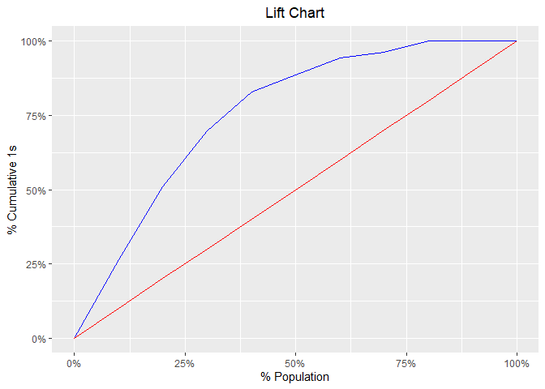
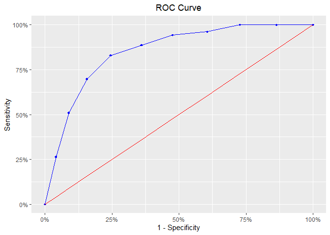
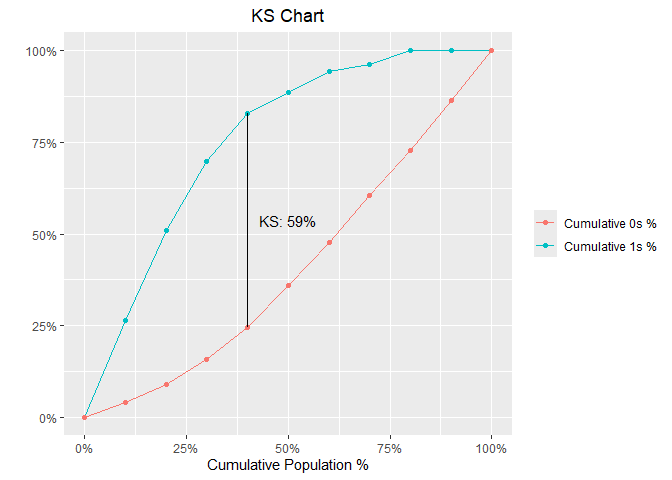
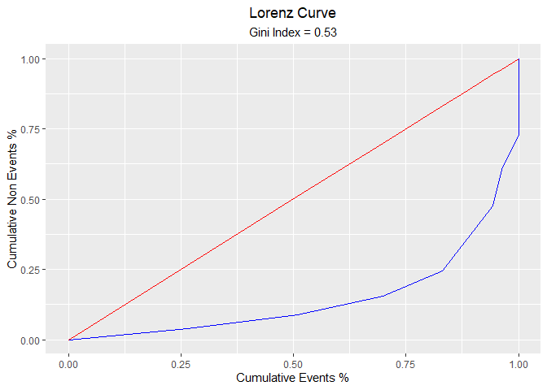

<!-- README.md is generated from README.Rmd. Please edit that file -->

# blorr

> Tools for building binary logistic regression models

<!-- badges: start -->

[](https://cran.r-project.org/package=blorr)
[](https://github.com/rsquaredacademy/blorr/actions/workflows/R-CMD-check.yaml)
[](https://app.codecov.io/github/rsquaredacademy/blorr?branch=master)

<!-- badges: end -->

## Overview

Tools designed to make it easier for users, particularly
beginner/intermediate R users to build logistic regression models.
Includes comprehensive regression output, variable selection procedures,
model validation techniques and a ‘shiny’ app for interactive model
building.

## Installation

``` r
# Install blorr from CRAN
install.packages("blorr")

# Install development version from GitHub
# install.packages("devtools")
devtools::install_github("rsquaredacademy/blorr")

# Install the development version from `rsquaredacademy` universe
install.packages("blorr", repos = "https://rsquaredacademy.r-universe.dev")
```

## Articles

- [A Short Introduction to the blorr
  Package](https://blorr.rsquaredacademy.com/articles/introduction.html)

## Usage

blorr uses consistent prefix `blr_*` for easy tab completion.

``` r
library(blorr)
library(magrittr)
```

### Bivariate Analysis

``` r
blr_bivariate_analysis(hsb2, honcomp, female, prog, race, schtyp)
#>                          Bivariate Analysis                           
#> ---------------------------------------------------------------------
#> Variable    Information Value    LR Chi Square    LR DF    LR p-value 
#> ---------------------------------------------------------------------
#>  female           0.10              3.9350          1        0.0473   
#>   prog            0.43              16.1450         2        3e-04    
#>   race            0.33              11.3694         3        0.0099   
#>  schtyp           0.00              0.0445          1        0.8330   
#> ---------------------------------------------------------------------
```

### Weight of Evidence & Information Value

``` r
blr_woe_iv(hsb2, prog, honcomp)
#>                            Weight of Evidence                             
#> -------------------------------------------------------------------------
#> levels    count_0s    count_1s    dist_0s    dist_1s        woe      iv   
#> -------------------------------------------------------------------------
#>   1          38          7           0.26       0.13       0.67     0.08  
#>   2          65          40          0.44       0.75      -0.53     0.17  
#>   3          44          6           0.30       0.11       0.97     0.18  
#> -------------------------------------------------------------------------
#> 
#>       Information Value       
#> -----------------------------
#> Variable    Information Value 
#> -----------------------------
#>   prog           0.4329       
#> -----------------------------
```

### Model

``` r
# create model using glm
model <- glm(honcomp ~ female + read + science, data = hsb2,
             family = binomial(link = 'logit'))
```

### Regression Output

``` r
blr_regress(model)
#>                              Model Overview                              
#> ------------------------------------------------------------------------
#> Data Set    Resp Var    Obs.    Df. Model    Df. Residual    Convergence 
#> ------------------------------------------------------------------------
#>   data      honcomp     200        199           196            TRUE     
#> ------------------------------------------------------------------------
#> 
#>                     Response Summary                     
#> --------------------------------------------------------
#> Outcome        Frequency        Outcome        Frequency 
#> --------------------------------------------------------
#>    0              147              1              53     
#> --------------------------------------------------------
#> 
#>                   Maximum Likelihood Estimates                    
#> -----------------------------------------------------------------
#>  Parameter     DF    Estimate    Std. Error    z value    Pr(>|z|) 
#> -----------------------------------------------------------------
#> (Intercept)    1     -12.7772       1.9755    -6.4677      0.0000 
#>   female1      1      1.4825        0.4474     3.3139       9e-04 
#>    read        1      0.1035        0.0258     4.0186       1e-04 
#>   science      1      0.0948        0.0305     3.1129      0.0019 
#> -----------------------------------------------------------------
#> 
#>  Association of Predicted Probabilities and Observed Responses  
#> ---------------------------------------------------------------
#> % Concordant          0.8561          Somers' D        0.7147   
#> % Discordant          0.1425          Gamma            0.7136   
#> % Tied                0.0014          Tau-a            0.2794   
#> Pairs                  7791           c                0.8568   
#> ---------------------------------------------------------------
```

### Model Fit Statistics

``` r
blr_model_fit_stats(model)
#>                               Model Fit Statistics                                
#> ---------------------------------------------------------------------------------
#> Log-Lik Intercept Only:      -115.644    Log-Lik Full Model:              -80.118 
#> Deviance(196):                160.236    LR(3):                            71.052 
#>                                          Prob > LR:                         0.000 
#> MCFadden's R2                   0.307    McFadden's Adj R2:                 0.273 
#> ML (Cox-Snell) R2:              0.299    Cragg-Uhler(Nagelkerke) R2:        0.436 
#> McKelvey & Zavoina's R2:        0.518    Efron's R2:                        0.330 
#> Count R2:                       0.810    Adj Count R2:                      0.283 
#> BIC:                          181.430    AIC:                             168.236 
#> ---------------------------------------------------------------------------------
```

### Confusion Matrix

``` r
blr_confusion_matrix(model)
#> Confusion Matrix and Statistics 
#> 
#>           Reference
#> Prediction   0   1
#>          0 135  26
#>          1  12  27
#> 
#> 
#>                 Accuracy : 0.8100 
#>      No Information Rate : 0.7350 
#> 
#>                    Kappa : 0.4673 
#> 
#> McNemars's Test P-Value  : 0.0350 
#> 
#>              Sensitivity : 0.5094 
#>              Specificity : 0.9184 
#>           Pos Pred Value : 0.6923 
#>           Neg Pred Value : 0.8385 
#>               Prevalence : 0.2650 
#>           Detection Rate : 0.1350 
#>     Detection Prevalence : 0.1950 
#>        Balanced Accuracy : 0.7139 
#>                Precision : 0.6923 
#>                   Recall : 0.5094 
#> 
#>         'Positive' Class : 1
```

### Hosmer Lemeshow Test

``` r
blr_test_hosmer_lemeshow(model)
#>            Partition for the Hosmer & Lemeshow Test            
#> --------------------------------------------------------------
#>                         def = 1                 def = 0        
#> Group    Total    Observed    Expected    Observed    Expected 
#> --------------------------------------------------------------
#>   1       20         0          0.16         20        19.84   
#>   2       20         0          0.53         20        19.47   
#>   3       20         2          0.99         18        19.01   
#>   4       20         1          1.64         19        18.36   
#>   5       21         3          2.72         18        18.28   
#>   6       19         3          4.05         16        14.95   
#>   7       20         7          6.50         13        13.50   
#>   8       20         10         8.90         10        11.10   
#>   9       20         13        11.49         7          8.51   
#>  10       20         14        16.02         6          3.98   
#> --------------------------------------------------------------
#> 
#>      Goodness of Fit Test      
#> ------------------------------
#> Chi-Square    DF    Pr > ChiSq 
#> ------------------------------
#>   4.4998      8       0.8095   
#> ------------------------------
```

### Gains Table

``` r
blr_gains_table(model)
#>    decile total  1  0       ks tp  tn  fp fn sensitivity specificity accuracy
#> 1       1    20 14  6 22.33346 14 141   6 39    26.41509    95.91837     77.5
#> 2       2    20 13  7 42.09986 27 134  13 26    50.94340    91.15646     80.5
#> 3       3    20 10 10 54.16506 37 124  23 16    69.81132    84.35374     80.5
#> 4       4    20  7 13 58.52907 44 111  36  9    83.01887    75.51020     77.5
#> 5       5    20  3 17 52.62482 47  94  53  6    88.67925    63.94558     70.5
#> 6       6    20  3 17 46.72058 50  77  70  3    94.33962    52.38095     63.5
#> 7       7    20  1 19 35.68220 51  58  89  2    96.22642    39.45578     54.5
#> 8       8    20  2 18 27.21088 53  40 107  0   100.00000    27.21088     46.5
#> 9       9    20  0 20 13.60544 53  20 127  0   100.00000    13.60544     36.5
#> 10     10    20  0 20  0.00000 53   0 147  0   100.00000     0.00000     26.5
```

### Lift Chart

``` r
model %>%
  blr_gains_table() %>%
  plot()
```

<!-- -->

### ROC Curve

``` r
model %>%
  blr_gains_table() %>%
  blr_roc_curve()
```

<!-- -->

### KS Chart

``` r
model %>%
  blr_gains_table() %>%
  blr_ks_chart()
```

<!-- -->

### Lorenz Curve

``` r
blr_lorenz_curve(model)
```

<!-- -->

## Getting Help

If you encounter a bug, please file a minimal reproducible example using
[reprex](https://reprex.tidyverse.org/index.html) on github. For
questions and clarifications, use
[StackOverflow](https://stackoverflow.com/).
